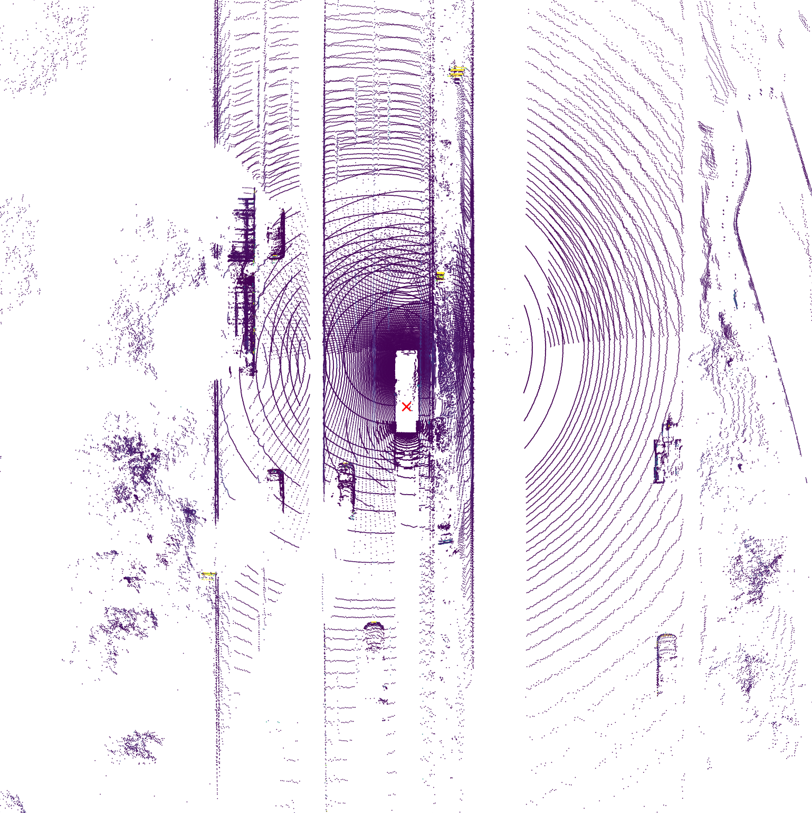
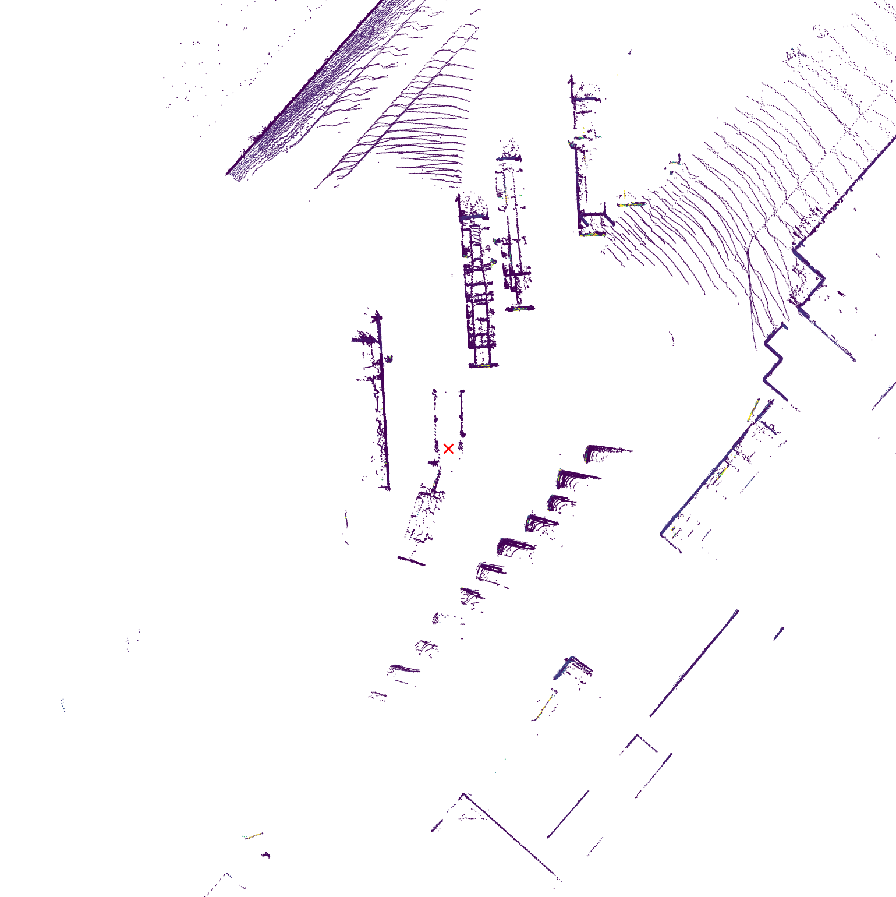
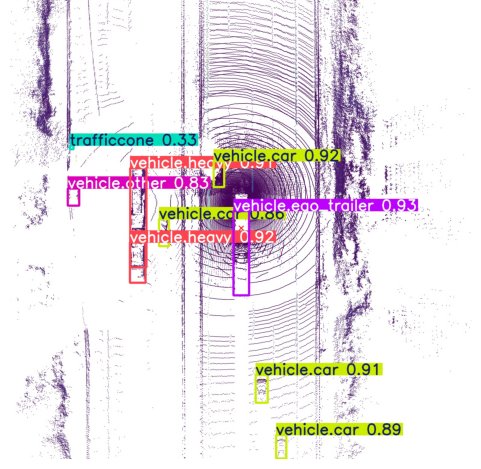
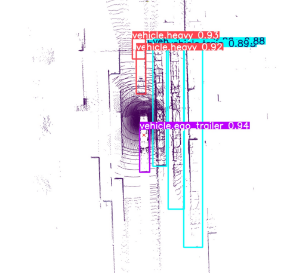

# BevLidar Object Detection

This project focuses on object detection using Bird’s Eye View (BEV) images generated from LiDAR point clouds. The dataset was created starting from the **TruckScenes-mini** dataset and consists of 800 images.

### 📄 Paper reference

For more information and to explore the source dataset in detail, refer to the (paper)[BEV_Object_Detection.pdf].


## 📦 Dataset and training summary

The dataset was generated using the `generate_bev_and_labels.py` script, which converts LiDAR point clouds into BEV images with and without Z-axis filtering. YOLOv8-compatible annotations were also produced.  
The model was trained using the Ultralytics YOLOv8 framework in two steps: an initial pretraining phase with a frozen backbone, followed by full fine-tuning with data augmentation.

<p align="center">
  
  
</p>


## 🧪 Testing and evaluation
- Open the [Colab Notebook](BEVLidar_ObjectDetection.ipynb).


- Download the truckscenes dataset and initialize the dataset in the section **Download Dataset** and **Initialization** in the notebook.

- To test the models, open the notebook and navigate to the section titled **YOLO Testing**.

#### ▶️ Setup and run

Install the required dependencies and download the dataset and model weights (code already present in the section):

```bash
!pip install ultralytics

!pip install -U gdown

!gdown "https://drive.google.com/uc?id=1NYUZYKDO-yAuqKjEQ0mQgRYGubt2aPPl"
!gdown "https://drive.google.com/uc?id=1eBZLkrGRM3ixVrTVrZYwjLyOoYeH8COu"


!unzip -q DATASET_COMPLETE.zip -d TEMP
!mkdir -p DATASET
!mv TEMP/DATASET_COMPLETE/* DATASET/
!rm -r TEMP


```

### 📊 Model validation

The notebook includes two validation blocks to evaluate and compare performance:

- **Results from YOLO model**: validation of a pretrained YOLOv8 model  
- **Results from my trained YOLO model**: validation of the custom-trained model on BEV data

#### 📈 Metrics comparison 

| Model                   | mAP@0.5 | mAP@0.5:0.95 | Precision | Recall |
|------------------------|---------|--------------|-----------|--------|
| Pretrained YOLOv8      |  1.6%  |     0.6%    |   2.5%   | 4.6%  |
| Custom-trained YOLOv8  |  **88%**  |     **71%**    |   **92%**   | **85%**  |


### 🖼️ Visual testing on example images

The last section of the notebook allows testing the trained model on three selected BEV images. The predictions are visually compared with the ground truth annotations.

<p align="center">
  
  
</p>


